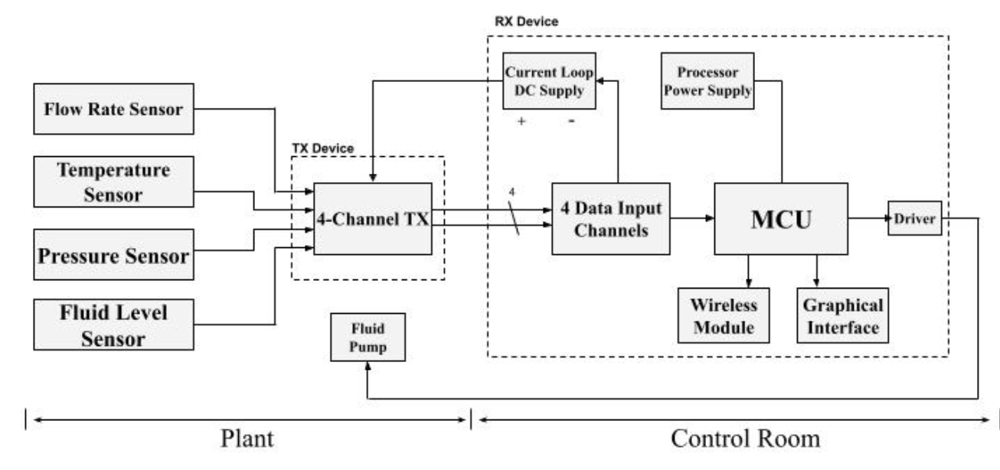
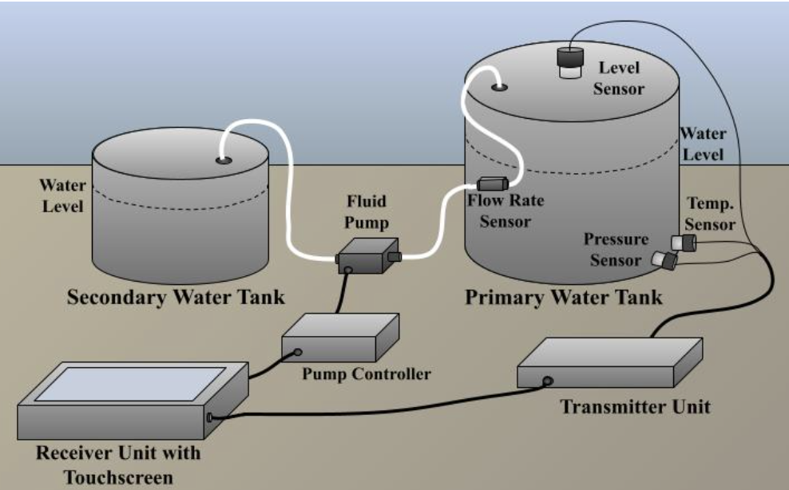

# 4---20-mA-Detector-Interface
This software supports the data processing, display graphics, and wireless data transmission for NNL's 4 - 20 mA detector interface project. 

Figure 1: System Level View

Figure 2: Conceptual Design

Figure 3: Final Design Implementation
